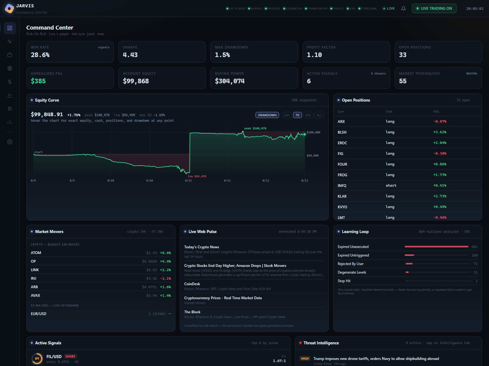
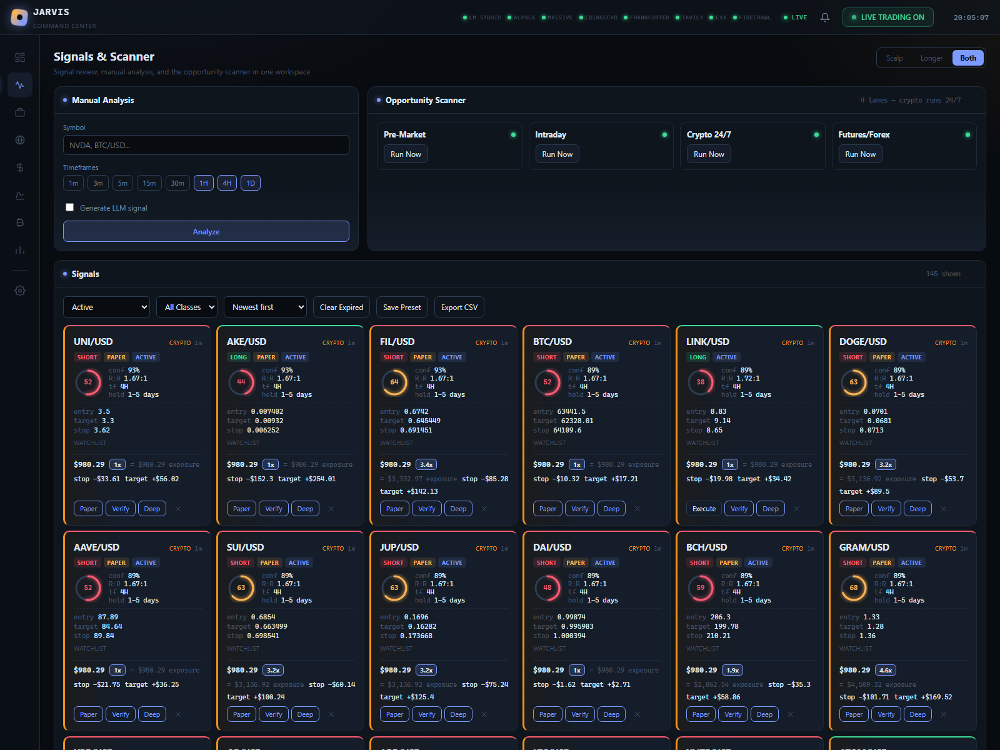
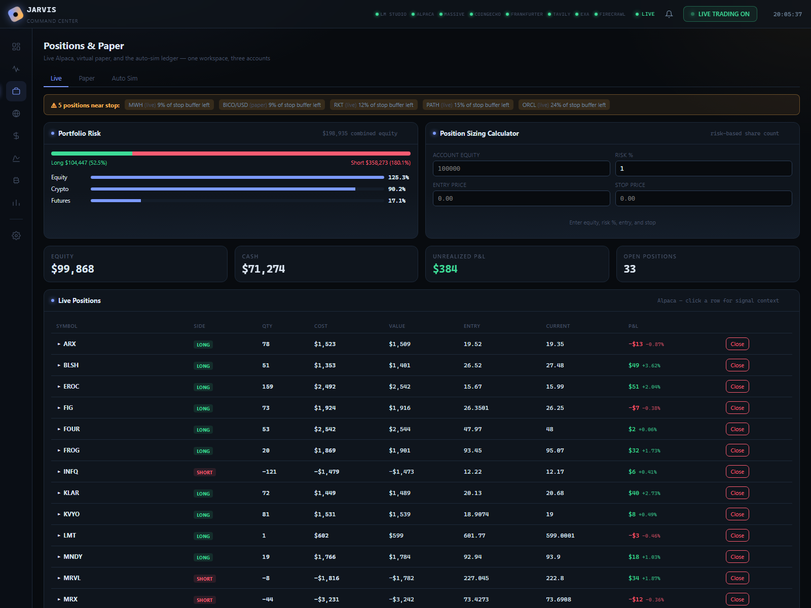
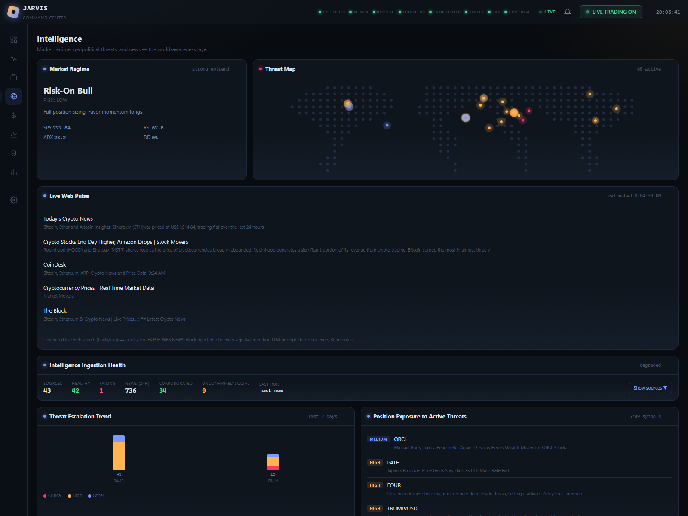
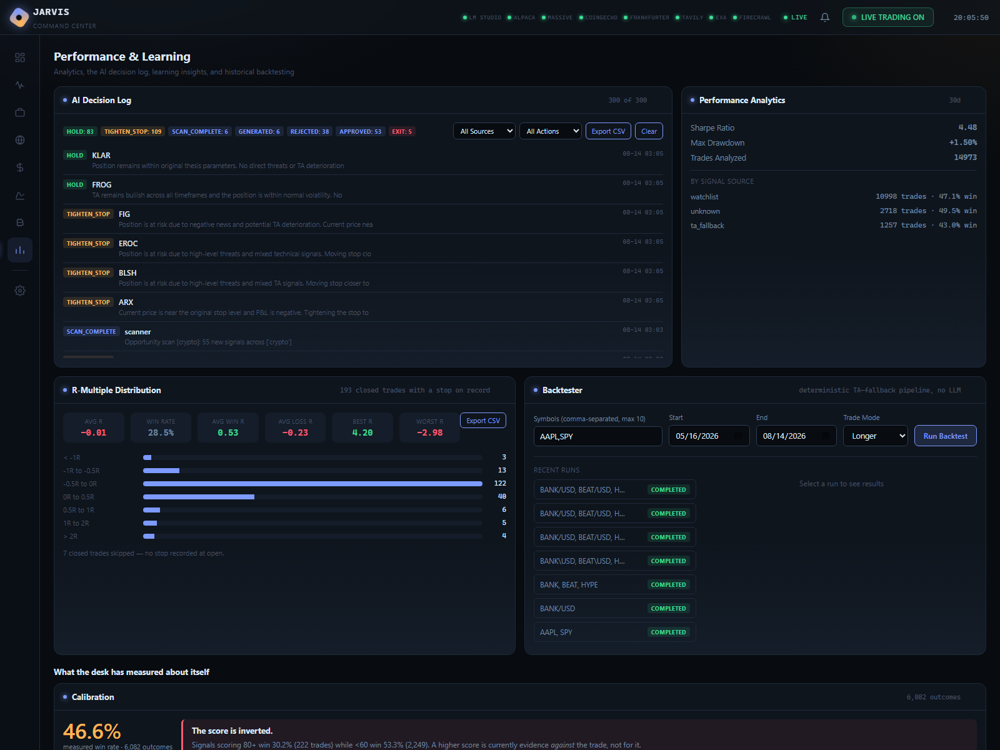
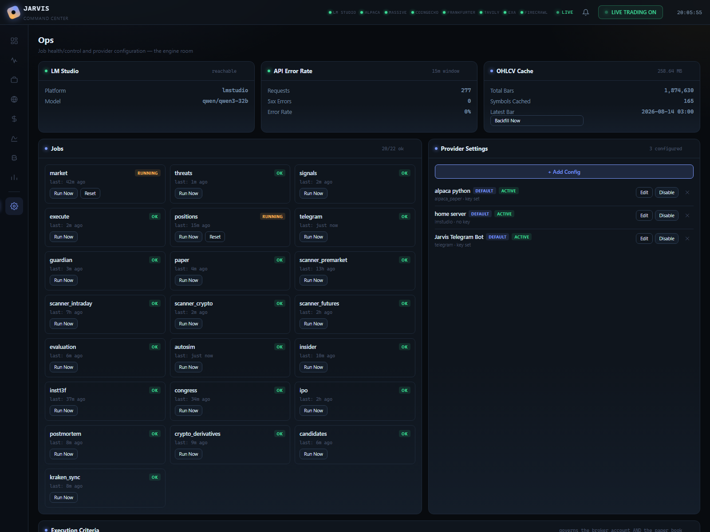

# J.A.R.V.I.S. — UI Guide

Six sections, one page each, reachable from the left nav rail. Screenshots
captured live 2026-08-13 (v8.0.0). The top HUD is constant everywhere:
provider health dots (LM Studio, Alpaca, Massive, CoinGecko, Frankfurter,
Tavily, Exa, Firecrawl), the LIVE/paper indicator, notifications, and the
master **LIVE TRADING ON/OFF** kill switch.

---

## Command Center (`#command`)

The battlefield view — everything that matters at a glance:

- **KPI strip** — win rate, Sharpe, max drawdown, profit factor, open
  positions, unrealized P&L, account equity, buying power, active signals,
  and the market-psychology index.
- **Equity curve** — live portfolio equity with drawdown shading, peak/low
  markers, and 24H/7D/30D/ALL ranges.
- **Open positions** — every live and paper position with side and P&L.
- **Market movers** — biggest 24h crypto moves plus FX majors.
- **Live web pulse** — unverified live web search, the same block injected
  into signal-generation prompts.
- **Learning loop** — the failure taxonomy (expired unexecuted, untriggered,
  rejected, degenerate levels, stop hit), classified deterministically and
  fed back as scoring penalties.
- **Active signals** and **threat intelligence** — top-scored setups and
  geopolitical/news threats.
- **Coins to watch** — the focus list, each with a scan-for-signals button.

## Signals & Scanner (`#signals`)

Where setups are born and judged:

- **Signal cards** — direction, timeframe, entry/target/stop, R:R, the
  composite score, and the *calibrated* confidence (measured win rate for
  that bucket, not the model's self-report).
- **Verify / deep-check** — a second LLM pass with progress feedback; the
  double-check button runs a full re-analysis.
- **Analysis modal** — full score breakdown per component, TA snapshot per
  timeframe, strategy classification with matched conditions, hold-time
  estimate from the horizon table.
- **Filters and presets** — by asset class, timeframe, direction, score
  band; presets persist.

## Positions & Paper (`#positions`)

The book, in three tabs:

- **Live** — Alpaca positions with quantity, margin actually committed,
  notional at leverage, protective orders.
- **Paper** — the simulated book for everything the live venue can't carry
  (unlisted crypto, shorts, leverage), priced with real venue fees and
  spreads. Quantity and margin shown for every row.
- **Auto Sim** — the autonomous simulator with its own P&L ledger, fee
  reserve, and hold-window exits.
- **Trade history** — closed trades with realized P&L, close reason, and
  per-trade R multiples (computed against the stop *as placed at open*,
  never the trailed stop).

## Intelligence (`#intelligence`)

The information edge:

- **Threat map** — geopolitical events scored by severity with market
  relevance.
- **Crypto derivatives** — funding, open interest, long/short ratio and
  liquidations from two venues (OKX + Crypto.com), with cross-venue
  dispersion.
- **Order book** — live L2 depth and imbalance for tracked pairs.
- **Smart money** — insider Form 4 clusters (grouped by ticker), 13F
  institutional moves, congressional trades, dark-pool prints.
- **News** — AI-tagged articles with sentiment and affected assets.

## Performance & Learning (`#performance`)

What the desk has measured about itself:

- **AI decision log** — every HOLD/TIGHTEN_STOP/EXIT/APPROVED/REJECTED with
  the model's reasoning, filterable and exportable.
- **Performance analytics** — Sharpe, max drawdown, win rate by signal
  source.
- **R-multiple distribution** — realized R per closed trade against
  *initial* risk, with degenerate-stop and futures-multiplier handling.
- **Calibration** — measured win rate by timeframe, score band, and
  strategy, with the honest headline (currently: the composite score is
  inverted — high scores are evidence *against* the trade).
- **Shadow scoring** — variants A/B/C compared on resolved outcomes,
  execution untouched.
- **Selection bias** — resolved counterfactuals for rejected candidates vs
  accepted ones: are the filters discarding winners?
- **Backtester** — deterministic TA-pipeline runs over history, no LLM.

## Ops (`#ops`)

The engine room:

- **Job status grid** — every scheduled job (signals, scanner modes, paper,
  guardian, candidates, kraken_sync, derivatives…) with last run and
  errors.
- **LLM router** — FAST/AUTO/DEEP call telemetry: counts, latency,
  thinking vs non-thinking, failures.
- **Provider health** — per-source connectivity and rate-limit state.
- **Kraken account** — read-only reconciliation: balances, open orders,
  measured fee tier, synced real fills.
- **Danger zone** — kill switch, epoch quarantine, and the soft-reset
  control (wipes derived state, keeps learned evidence).
